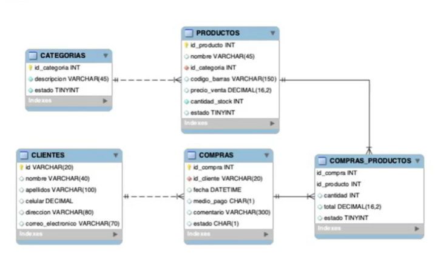
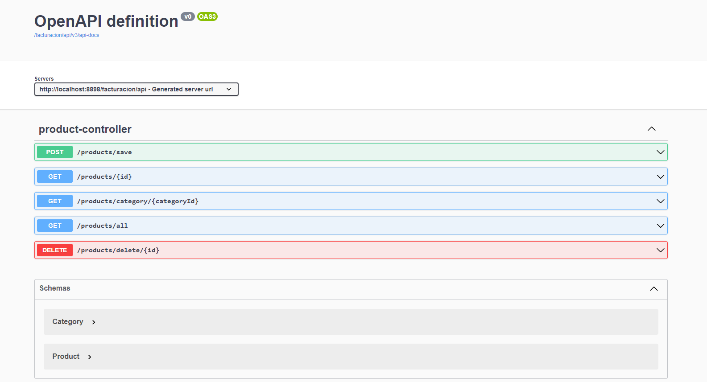

# API-Facturacion

# Getting Started

# Project

1. Gradle - Groovy 

2. Spring Boot 3.3.1

3. Language: Java 21

# Database

1. 

# Documentacion

http://localhost:8898/facturacion/api/swagger-ui/index.html#/

# Resources

https://mvnrepository.com/
https://plugins.jetbrains.com/plugin/10036-mapstruct-support/versions/stable
https://mapstruct.org/documentation/installation/

