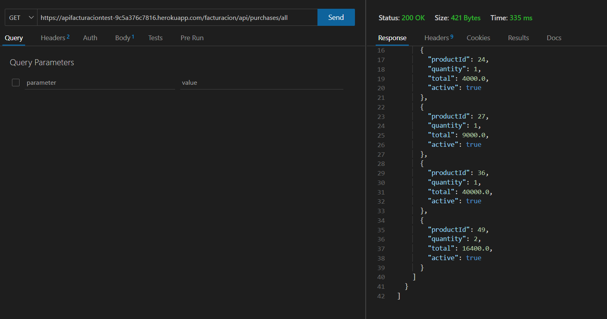
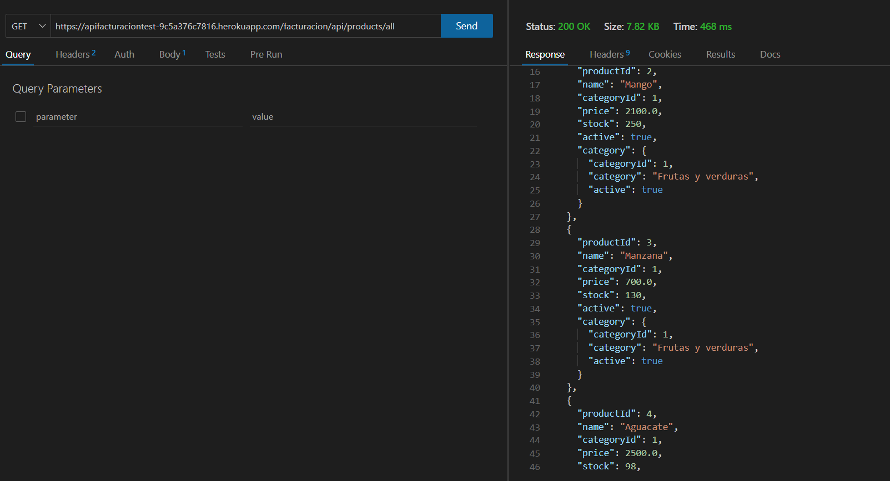

# API-Facturacion

# Getting Started

# Project

1. Gradle - Groovy 

2. Spring Boot 3.3.1

3. Language: Java 21

# Database

# Documentacion

http://localhost/facturacion/api/swagger-ui/index.html#/

# Run

java -jar build/libs/App-1.0.jar

# Heroku - Running API Backend

1. See all purchases
https://apifacturaciontest-9c5a376c7816.herokuapp.com/facturacion/api/purchases/all

2. Sell all products
https://apifacturaciontest-9c5a376c7816.herokuapp.com/facturacion/api/products/all

# Resources

https://mvnrepository.com/
https://plugins.jetbrains.com/plugin/10036-mapstruct-support/versions/stable
https://mapstruct.org/documentation/installation/

